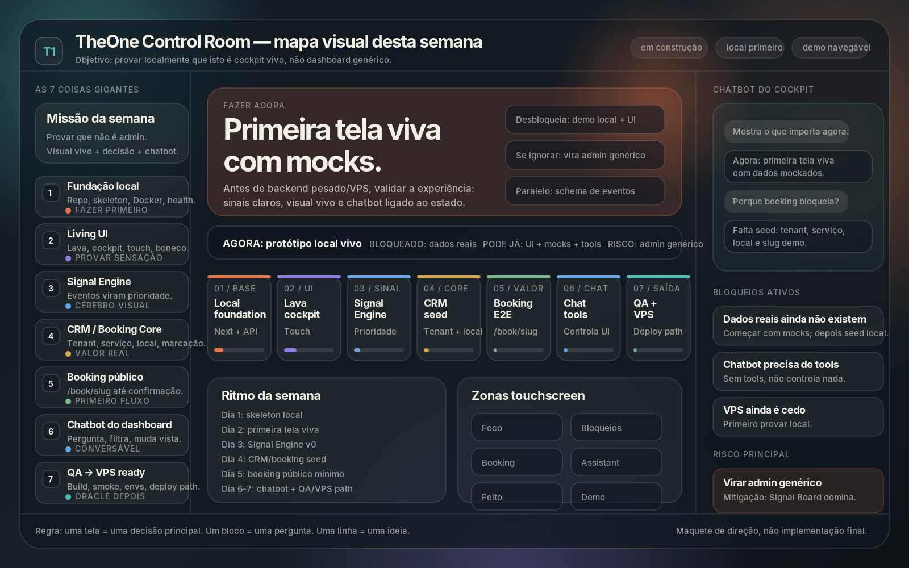
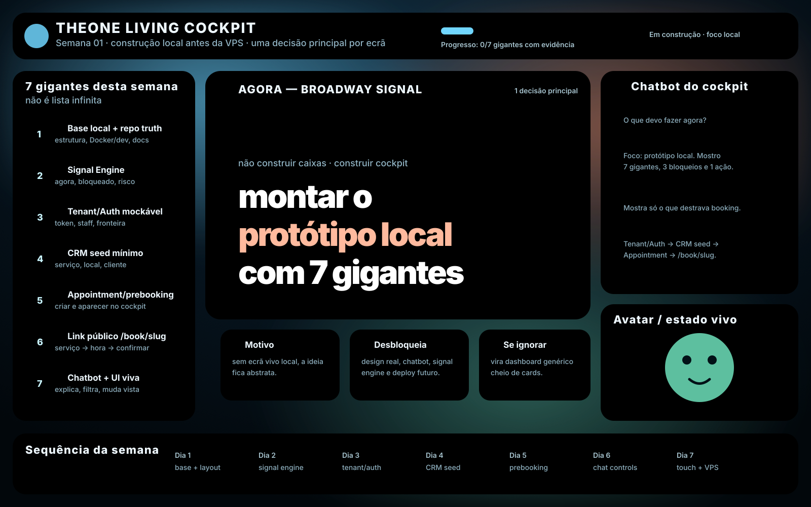

# Semana 01 — TheOne Living Cockpit Map

## Objetivo desta semana

Criar localmente o primeiro protótipo vivo do dashboard TheOne, antes de levar para a VPS.

O alvo não é construir já o produto completo. O alvo é provar a sensação certa:

```text
O utilizador olha.
Entende o estado.
Sabe o que fazer.
Pode perguntar ao dashboard.
O dashboard responde com base no estado.
O visual muda conforme o sistema.
```

## Mapa visual



Versão SVG: [`assets/theone-week-dashboard-visual-map.svg`](./assets/theone-week-dashboard-visual-map.svg)

Wireframe base:



## Layout conceptual

```text
┌──────────────────────────────────────────────────────────────────────┐
│ THEONE LIVING COCKPIT                                                │
│ Semana 01 · Local build · Progresso · Estado · Pergunta central       │
└──────────────────────────────────────────────────────────────────────┘

┌──────────────────────┬───────────────────────────────┬───────────────┐
│ 7 GIGANTES            │ 🔥 AGORA                      │ 🤖 CHATBOT     │
│ da semana             │ Broadway Signal               │ do cockpit     │
│                       │                               │               │
│ 1. Base local         │ “montar o protótipo local     │ conversa com   │
│ 2. Signal Engine      │  com 7 gigantes visíveis”     │ o dashboard    │
│ 3. Tenant/Auth        │                               │               │
│ 4. CRM seed           │ Motivo / Desbloqueia / Risco  │ Avatar/estado  │
│ 5. Prebooking         │                               │ vivo           │
│ 6. /book/slug         │                               │               │
│ 7. Chatbot + UI viva  │                               │               │
├──────────────────────┴───────────────────────────────┴───────────────┤
│ 🔴 Bloqueado | 🔵 Pode já | ⚡ Paralelo | ✅ Feito                    │
├──────────────────────────────────────────────────────────────────────┤
│ Sequência da semana: Dia 1 → Dia 2 → Dia 3 → Dia 4 → Dia 5 → Dia 6... │
└──────────────────────────────────────────────────────────────────────┘
```

## Os 7 gigantes da semana

### 1. 🧱 Base local + repo truth

Objetivo: conseguir trabalhar localmente sem depender já da VPS.

Inclui:

- estrutura do projeto;
- README claro;
- Docker/dev básico;
- docs canônicas;
- script para correr localmente.

Sem isto, tudo vira improviso.

### 2. 🧠 Signal Engine

Objetivo: decidir o que aparece como `AGORA`, `bloqueado`, `pode já`, `risco` e `feito`.

Este motor impede o dashboard de virar caixas genéricas.

Ele transforma:

```text
dados soltos
tarefas
erros
estado do projeto
bloqueios
```

em:

```text
🔥 faz isto agora
🔴 isto está bloqueado
🔵 isto pode começar
⚡ isto dá para fazer em paralelo
✅ isto já avançou
⚠️ isto é risco
```

### 3. 👤 Tenant/Auth mockável

Objetivo: simular tenant, staff e acesso protegido.

Não precisa ser perfeito já, mas precisa existir localmente. O TheOne depende de isolamento por negócio.

### 4. 🗂️ CRM seed mínimo

Objetivo: ter dados mínimos reais ou mockados:

```text
1 serviço
1 local
1 cliente/demo
1 tenant
1 booking_slug
```

Sem CRM seed, booking é só estética.

### 5. 📅 Appointment / prebooking

Objetivo: criar uma marcação/prebooking e mostrar isso no cockpit.

Quando isto funciona, o dashboard deixa de ser só plano. Ele passa a reagir a eventos reais.

### 6. 🌍 Link público `/book/{slug}`

Objetivo: alguém conseguir ir a um link público, escolher serviço, horário e confirmar.

Mesmo que seja simples, este fluxo prova que o produto tem uma ponta pública funcional.

### 7. 🤖 Chatbot + UI viva

Objetivo: conversar com o dashboard, filtrar informação e controlar a vista.

Comandos iniciais:

```text
O que devo fazer agora?
Mostra só o que destrava booking.
Porque isto está bloqueado?
Esconde o visual e mostra só riscos.
Entra em modo foco.
Mostra a sequência até primeiro booking funcional.
```

O chatbot não é ornamento. Ele é uma interface para o cockpit.

## Camadas visuais

### 1. Fundo vivo

Wallpaper tipo lava lamp, orgânico e emocional.

Estados sugeridos:

```text
calmo       → lava lenta, cores suaves
ocupado     → movimento mais rápido
alerta      → pulsação, brilho, contraste
erro grave  → centro toma foco, fundo escurece
```

### 2. Centro Broadway / Signal Board

O centro não é um gráfico. O centro é a decisão.

```text
🔥 AGORA
montar o protótipo local com 7 gigantes visíveis

🧠 Motivo
🔓 Desbloqueia
⚠️ Se ignorar
```

### 3. Coluna esquerda — 7 gigantes

Mostra as frentes grandes da semana, não 40 tarefas pequenas.

Cada gigante mostra:

```text
nome
estado
porquê importa
o que destrava
```

### 4. Coluna direita — chatbot + avatar

Funções:

```text
conversar com o dashboard
explicar estado atual
mudar vistas
focar blocos
resumir riscos
```

O avatar reage ao estado:

```text
calmo
pensativo
alerta
feliz
focado
```

### 5. Timeline inferior

Linha de avanço da semana:

```text
Dia 1: base + layout
Dia 2: signal engine
Dia 3: tenant/auth
Dia 4: CRM seed
Dia 5: prebooking
Dia 6: chatbot controla painéis
Dia 7: touch review + preparação VPS
```

## Regra principal

```text
Uma tela = uma decisão principal.
Um bloco = uma pergunta.
Uma linha = uma ideia.
```

## Anti-padrões

Evitar:

- cards genéricos demais;
- texto longo dentro de cards;
- gráficos sem decisão associada;
- duas ações principais competindo;
- percentuais sem contexto;
- ícones decorativos sem significado;
- mostrar roadmap inteiro no bloco `AGORA`;
- esconder bloqueios importantes.

## Primeira decisão operacional

```text
AGORA não é VPS.
AGORA não é perfeição visual.
AGORA não é backend completo.

AGORA é:
criar localmente o protótipo vivo do cockpit,
com dados mockados,
os 7 gigantes,
o bloco AGORA,
bloqueados,
paralelos,
feito,
riscos
e chatbot básico.
```
